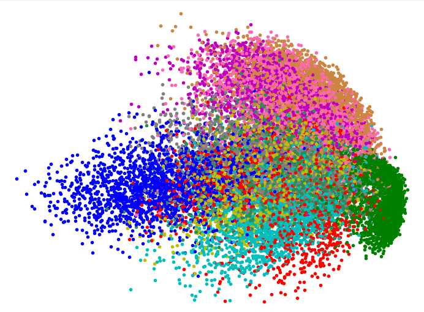
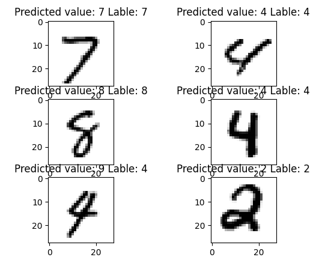

# DV516-assignment-1

Assignment 1 <br>
By: André Franzén (af223kr) <br>
Course: 1DV516 <br>
Date: March-April 2022


# Task 1
File name `microships.py`
### How to run
In order to run task 1.2 Where the predefined points are calculated run the `perdictForPredefPoints()` (In order to avoid messy output) <br>
To run Task 1.3 and display the plots just run the python file

### Comments
I have gone through many many iterations to try to make it quicker but and have to great lengths succeeded. I have cut down the time it takes from my original working solution by more than 75% But it still takes some time to run and I Think its due to how i calculate the distances

```python
for x,y,ok in points:
        #d=√((x_2-x_1)²+(y_2-y_1)²)
        dis = sqrt( pow((z[0] - x),2) + pow((z[1] - y),2) )
        distanceList.append( ((x, y, ok),dis) )
```
I want to great lengths to try to understand and how to use distance matrices and there for be able to use broadcast but i did not succeed.

### Result 

Time to complete (on my pc) 6.5s to compute above image

<br>

# Task 2
File name `polynomial.py`
### How to run
Run the python file, (2 plots will open 1 corresponding to task 1.2) and the other with the MSE errors and regression lines

### Comments
For this task I am happy about my implementation there are probably better ways as i use a fair few loops but all in all its pretty quick.

Note! the MSE should in theory be 0 for the one with K = 1 but due to the dots being to close together even a very very small stepsize is needed.
<br>
2.5: Which K gives the best regression Motivate your answer! I Think that the K = 9 is the best K this is due to it having the lowest MSE test error. training error does not really give alot of insight this is why i make my pick based on MSE test value

### Result 

Time to complete (on my pc) 6s to compute above image

# Task 3 - VG
File name ``MNIST_V2.py`` & ``MNIST.py``
### How to run
Run the python file ``MNIST_V2.py`` this will do two things <br>
1. Plot 6 numbers from the dataset and the predicted values for them.
2. Predict 100 random numbers and print the result
### Comments
To complete this exercise it took me two attempts, I first started off by learning and trying PCA this is a way to reduce the amount of dimensions (in my case down to two) so that i could plot the input just like in exercise 1. This later turned out to be the wrong approach and lead to the first program only predicting about 45% correct.
<br><br>
My second attempt was much more successfull and much less complicated. I reuse much of what i have learnt from exercise 1 combined with my previous attempt.
<br><br>
To find the best value for K i tried many different ranging from 1 to 11 and found 3 to be the best. (had the best accuracy for the test values)
### Results
Here is the 1st attempt where i tried to use PCA to lower the dimensions of the input to only two.
This successfully guessed the correct number about 45% of the time due to the immense data lost with PCA


<br>
Here is the 2nd attempt this is much more successfull.


This guesses the correct number around 95% of the time.


# Task 4
File name ``sckitMicroShips.py``
### How to run
Run the python file ``sckitMicroShips.py``
### Comments
I am happy with my implementation was fun to see how much easier it was with the library
### Results

Time to complete (on my pc) 3s to compute above image